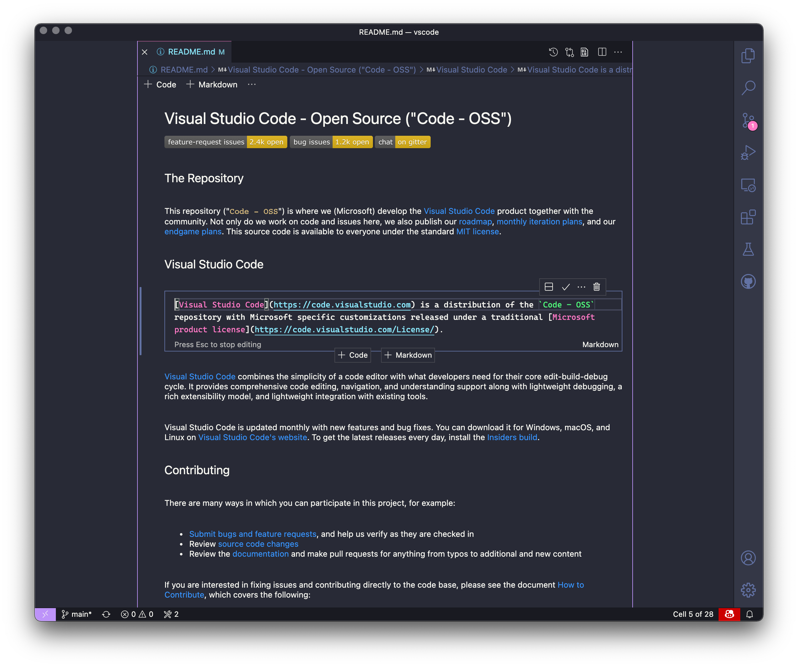

# Markdown Notebook

This is a simple extension for opening a markdown file in a VS Code notebook. It shows text paragraphs in markdown cells, and code blocks in code cells. It doesn't support executing code cells (but you could write an extension that [adds that functionality](https://github.com/microsoft/vscode/blob/50b3811fdc5b5c80ca516a2edfffedcbd464b033/src/vs/vscode.d.ts#L12276)!). It tries to maintain the formatting of your markdown file, but you may see minor tweaks. No warrantee given. It does not maintain line endings (it will read CRLF but will output LF).

## Use

- Install the extension
- Right click a .md file, "Open With..."
- Select "Markdown Notebook"

# Contributing

This project welcomes contributions and suggestions.  Most contributions require you to agree to a
Contributor License Agreement (CLA) declaring that you have the right to, and actually do, grant us
the rights to use your contribution. For details, visit https://cla.opensource.microsoft.com.

When you submit a pull request, a CLA bot will automatically determine whether you need to provide
a CLA and decorate the PR appropriately (e.g., status check, comment). Simply follow the instructions
provided by the bot. You will only need to do this once across all repos using our CLA.

This project has adopted the [Microsoft Open Source Code of Conduct](https://opensource.microsoft.com/codeofconduct/).
For more information see the [Code of Conduct FAQ](https://opensource.microsoft.com/codeofconduct/faq/) or
contact [opencode@microsoft.com](mailto:opencode@microsoft.com) with any additional questions or comments.
